# Como instalar o MacOS Big Sur no VirtualBox Windows 10 ou 11

Neste guia, orientaremos você em todas as etapas para instalar o macOS Big Sur no VirtualBox Windows. Mostraremos cada etapa com capturas de tela e um vídeo para orientá-lo visualmente.

## O que é macOS Big Sur

O macOS Big Sur é o 17º lançamento do sistema operacional Mac para computadores Macintosh e é o sucessor do macOS Catalina. O sistema operacional foi lançado oficialmente ao público em 12 de novembro de 2020 e está disponível para uma série de computadores Mac e também pode ser instalado virtualmente, como neste guia.

## Necessário para Instalação:
- Windows10
- 8GB RAM
- 60 GB de espaço livre em disco
- VirtualBox Oracle VM VirtualBox Extension Pack ([**Baixar**](https://www.virtualbox.org/wiki/Downloads))
- Arquivo de imagem ISO do MacOS Big Sur ([**Baixar**](https://www.mediafire.com/file/irna8hwybkhl41f/BigSur13-3-1.iso/file)) ou ([Mac App Store Preview](https://apps.apple.com/us/app/macos-big-sur/id1526878132?mt=12)).
- Comandos no CMD como Administrador

## 1. Criar Maquina virtual no VirtualBox
Para começar, precisamos instalar o VirtualBox Windows. Se você já fez isso, este artigo o guiará por todo o processo. Depois que o VirtualBox estiver funcionando, queremos garantir que você tenha seu arquivo de comando e o arquivo ISO do Big Sur à mão. Vamos precisar deles para prosseguir.

1.1. No Oracle VM VirtualBox Manager, como o ícone azul 'Novo' na parte superior


1.2. Na primeira janela, estaremos nomeando e identificando o tipo de máquina virtual que estamos criando. No campo Name, digite ‘BigSur.’ O campo Machine Folder pode permanecer como padrão, a menos que você tenha um motivo para alterá-lo. O tipo será Mac OS X. A versão será ‘macOS 10.13 High Sierra (64 bits).

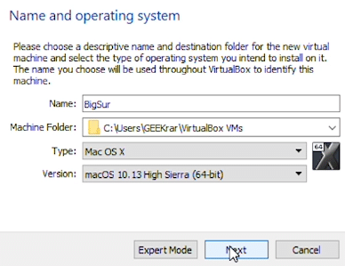

1.3. Em Tamanho da memória, queremos aumentar a memória disponível para pelo menos 8 GB de RAM. Clique em Avançar

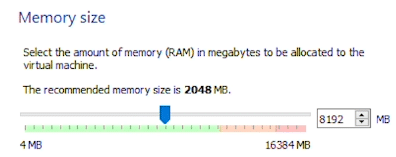

1.4. 'Disco rígido', vamos deixar o padrão 'Criar um disco rígido virtual agora' e clicar em 'Criar'.

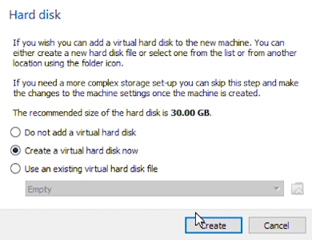

1.5. O ‘tipo de arquivo de disco rígido’ também permanecerá com o VHD (Disco Rígido Virtual) padrão. Clique em Avançar.

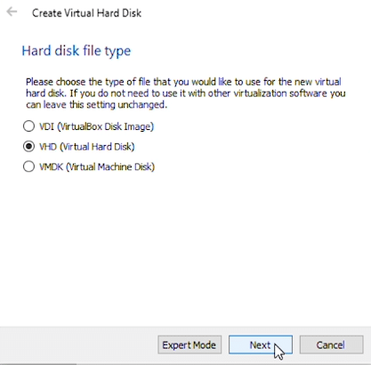

1.6. 'Armazenamento no disco rígido físico' será alocado dinamicamente.

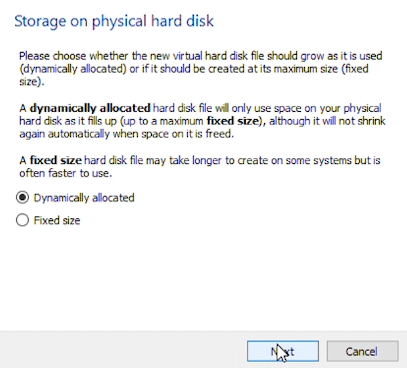

1.7. Em 'Localização e tamanho do arquivo', estamos deixando o caminho da pasta padrão, mas abaixo do tamanho do disco, queremos aumentá-lo para pelo menos 60 GB. Eu tentei 40 GB e 50 GB com muitos problemas. Portanto, 60 ou mais é fortemente sugerido. Depois de concluído, clique em 'Criar' e conclua a primeira etapa.

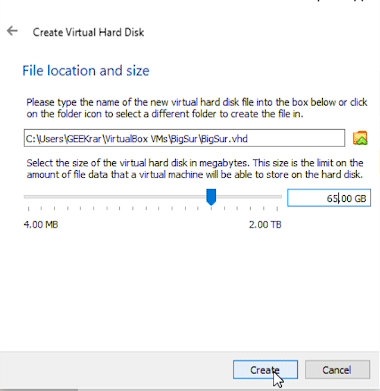

## 2. Modificar o VirtualBox com CMD

Agora que o novo VirtualBox foi criado, precisamos executar alguns comandos para modificá-lo e continuar executando o macOS Big Sur. Se você não baixou o texto do arquivo de comando, clique aqui para obtê-lo.

2.1. Abra o arquivo de texto, vá para o menu 'Editar' na parte superior e depois para baixo até 'Substituir ..." Aqui, queremos digitar "VBoxNAME" no campo 'Localizar'. No campo 'Substituir por', digite o nome que você chamou de VirtualBox (etapa 2). Clique no botão 'Substituir tudo', e isso deve converter todos os itens com o novo nome de arquivo.

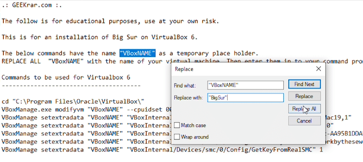

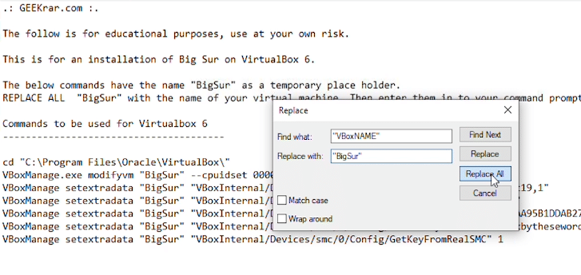

2.2. Agora vá até o prompt de comando (Iniciar, digite 'cmd' e aperte enter), cole a primeira linha e aperte enter. (execute o prompt de comando como administrador)
```bash
cd "C:\Arquivos de Programas\Oracle\VirtualBox\"
```
2.3. Este comando nos deslocará para o diretório Windows do VirtualBox e estaremos prontos para os próximos comandos.


2.4. Antes de prosseguir, verifique se você está no diretório acima. Se você não estiver lá, você deve navegar para lá agora antes de prosseguir.

Realce e copie as próximas seis linhas, cole-as na janela de comando e pressione enter.

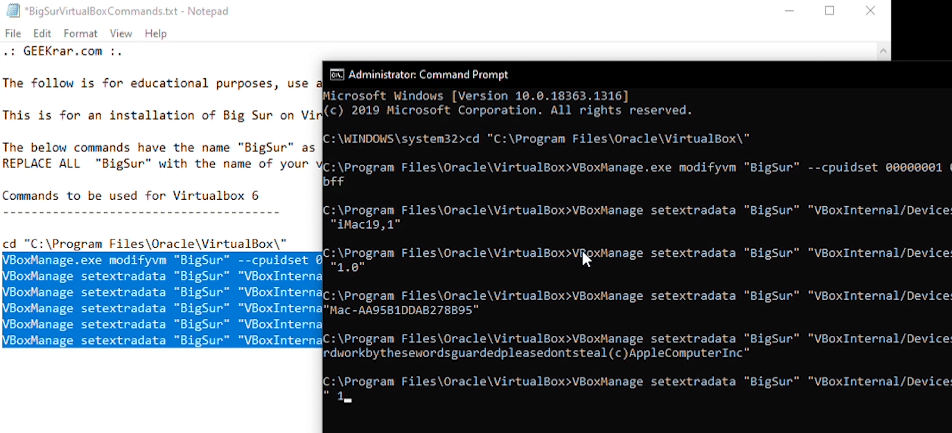

2.5. Feito isso, podemos fechar todas as janelas e começar a carregar o macOS Big Sur no VirtualBox Windows.

## 3 – Configuração para instalar o macOS Big Sur no VirtualBox Windows

Durante esta etapa, precisaremos ter o arquivo ISO do macOS Big Sur disponível. Se você ainda não baixou, clique aqui para obtê-lo.

3.1. Primeiro, abra o VirtualBox e selecione a máquina virtual macOS Big Sur recém-criada à esquerda e clique no botão 'Iniciar' na parte superior.

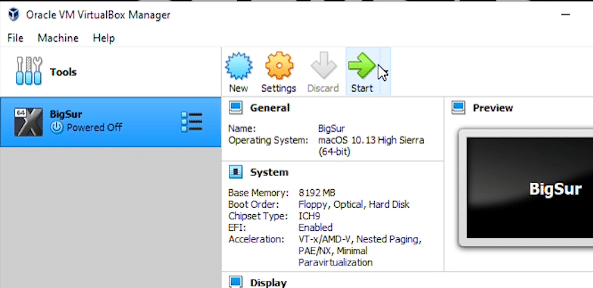

3.2. Seremos solicitados a 'Selecionar disco de inicialização', clique no ícone da pasta à direita


3.3. No 'Seletor de disco óptico', clique no ícone 'Adicionar' e navegue até a pasta onde você baixou o arquivo Big Sur ISO. Depois de selecionado, clique em 'Abrir' e, de volta à janela com o Big Sur ISO selecionado, clique em 'Escolher'.

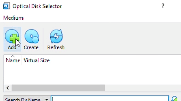

3.4. De volta à janela 'Selecionar disco de inicialização, agora devemos ter o BigSur ISO preenchido no campo e estamos prontos para clicar em 'Iniciar'.

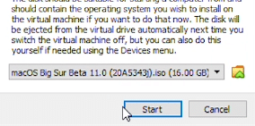

3.5. O sistema operacional macOS Big Sur começará a carregar. Esta etapa pode levar alguns minutos, mas uma solicitação aparecerá para selecionar um idioma para continuar quando terminar.

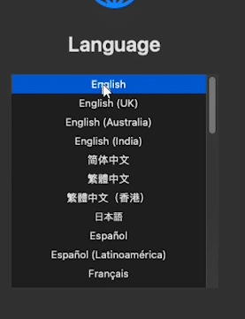

3.6. Agora queremos preparar a unidade para instalação. Formataremos a unidade para permitir a instalação do macOS Big Sur. Clique em 'Utilitário de disco' e continue.

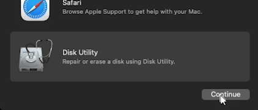

3.7. Na janela Disk Utility, selecione a opção VBOX HARDDISK à esquerda e o ícone ERASE na parte superior.


3.8. No campo Nome, atribua um rótulo à unidade, deixe as outras opções como padrão e clique em Apagar. Isso irá formatar a unidade para macOS. Quando a formatação estiver concluída, clique em 'Concluído' e você pode fechar a janela do Utilitário de Disco.

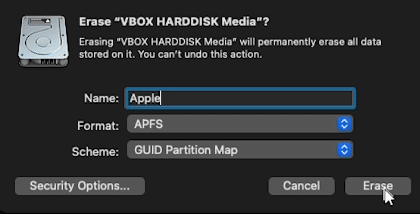

3.9. Agora estamos prontos para começar a instalar o macOS Big Sur. Clique na opção que diz 'Instalar macOS' e clique no botão Continuar.

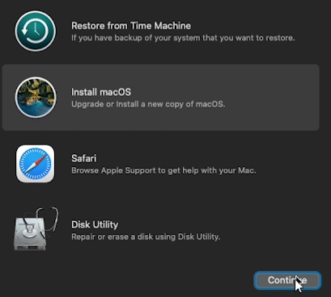

3.10. Você será solicitado duas vezes pelos termos do contrato de licença de software. Para prosseguir, clique em ‘Concordo’ para ambos.

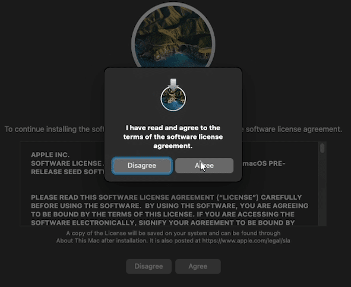

3.11. Vamos selecionar uma unidade, que deve ser a única unidade disponível, e clicar em Continuar.


3.12. Agora o macOS Big Sur será copiado e instalado. Este processo levará de 15 a 30 minutos para ser concluído.

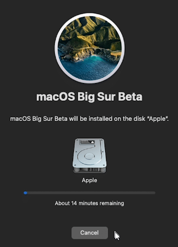

3.13. Depois que os arquivos forem copiados, precisamos encerrar a instalação com alguns detalhes de personalização. Selecione Seu país ou região solicitará que você selecione sua localização e clique em Continuar.

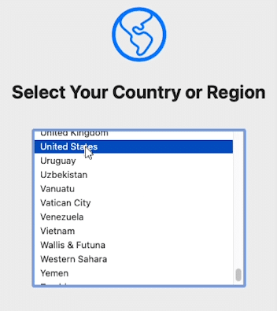

3.14. Em Idiomas escritos e falados, você pode deixar as configurações padrão. Se você quiser alterá-los, clique na opção de personalização no canto inferior esquerdo ou clique em Continuar.

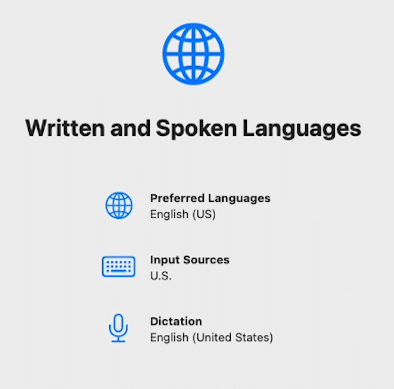

3.15. Para opções de Acessibilidade, Dados e Privacidade e Assistente de Migração, você pode clicar em Continuar.

No Sign In with Your Apple ID, selecione a opção ‘Set Up Later’ no canto inferior esquerdo e ‘Skip’ quando solicitado.

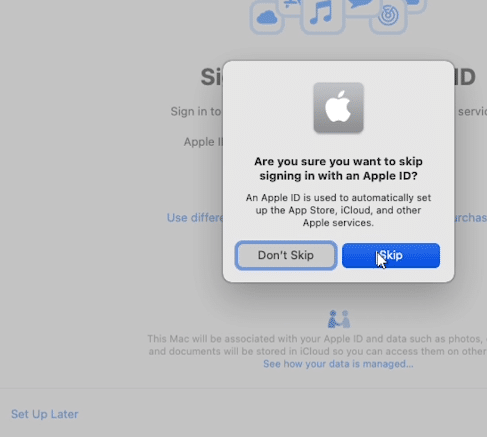

3.16. Para os Termos e Condições, você será solicitado duas vezes. Selecione ‘Concordo’ ambas as vezes para prosseguir.

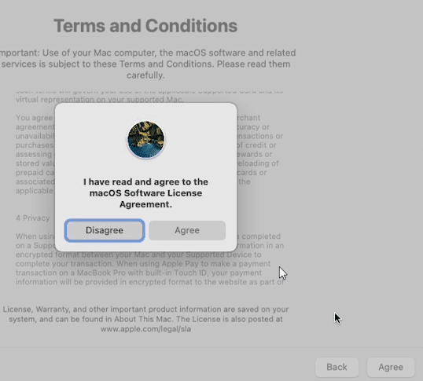

3.17. Na janela Create a Computer Account (Criar uma conta de computador), digite um nome e uma senha para o seu perfil de usuário e clique em Continue.

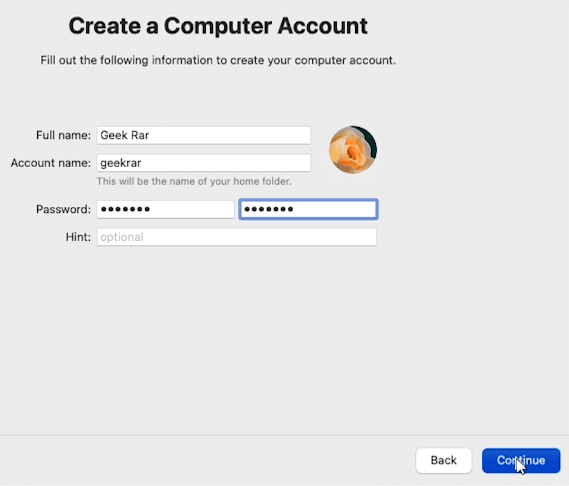

3.18. Em seguida, para Express Setup, Analytics e Screen Time, podemos clicar em Continue. Sua máquina virtual concluirá sua configuração e reiniciará. Depois de iniciar, uma tela de login aparecerá - digite a senha que você atribuiu ao criar o perfil de usuário.

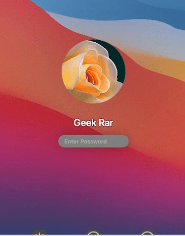

3.19. Por fim, aparecerá um prompt para um Assistente de feedback. Você pode continuar com ele ou fechá-lo.

Agora, você verá a área de trabalho do macOS Big Sur pela primeira vez. A instalação está completa! Você pode começar a usar a área de trabalho e instalar os aplicativos que desejar.

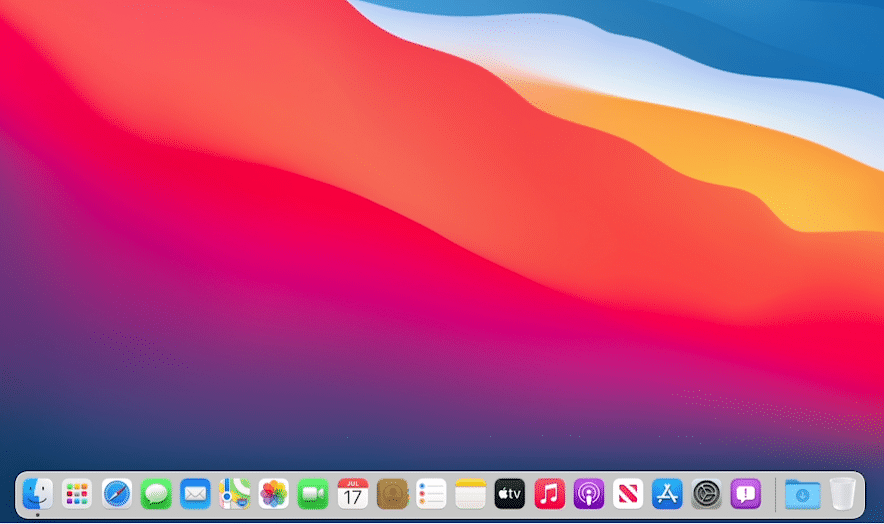
